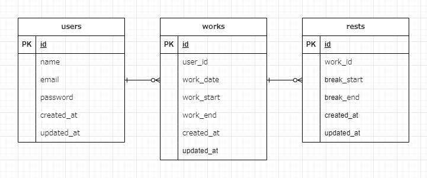

# Atte（アット）
「企業の勤怠管理システム」

## 作成した目的
・企業内での人事評価のため

## アプリケーションURL
- 開発環境：http://localhost/  
- phpMyAdmin:：http://localhost:8080/  

## 他のリポジトリ
- バックエンドのリポジトリ  
- フロントエンドのリポジトリ  

## 機能一覧
- ログイン機能

## 使用技術（実行環境）
- PHP8.3.0  
- Laravel8.83.27  
- MySQL8.0.26  

## テーブル設計
  

#環境構築
**Laravel環境構築**
1. `docker-compose exec php bash`  
2. `composer install`  
3. 「.env.example」ファイルを 「.env」ファイルに命名を変更。または、新しく.envファイルを作成
4. .envに以下の環境変数を追加
``` text
DB_CONNECTION=mysql  
DB_HOST=mysql  
DB_PORT=3306  
DB_DATABASE=laravel_db  
DB_USERNAME=laravel_user  
DB_PASSWORD=laravel_pass  
```
5. アプリケーションキーの作成
``` bash  
php artisan key:generate  
```  

6. マイグレーションの実行
``` bash  
php artisan migrate  
```  

7. シーディングの実行
``` bash  
php artisan db:seed  

## 他に記載することがあれば記述する  
#アカウントの種類（テストユーザーなど）
